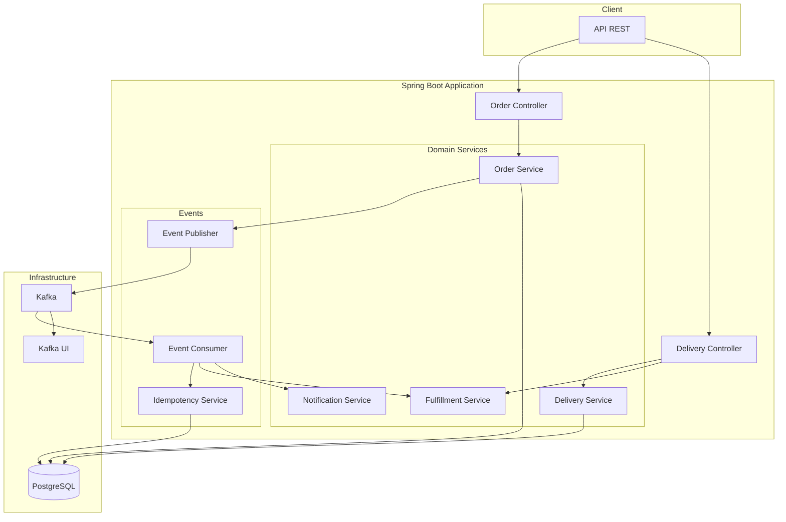
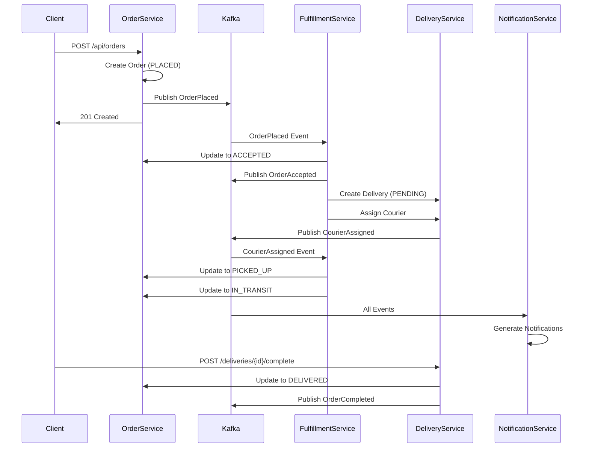

# Order Fulfillment and Delivery Tracking Platform

> Backend platform for order and delivery management inspired by large-scale delivery systems. Implements event-driven architecture with Kafka, persistent idempotency, and complete observability.

[](https://www.oracle.com/java/)
[](https://spring.io/projects/spring-boot)
[](https://kafka.apache.org/)
[](https://www.postgresql.org/)

## Overview

This project implements the backend of a delivery platform focused on order fulfillment, modeling real-world problems of critical systems where reliability, consistency, and user experience are priorities.

The platform covers the complete lifecycle of an order from creation to delivery (or failure), with emphasis on:
- Complex state management with validation
- Asynchronous event-based communication
- Persistent idempotency
- End-to-end traceability
- Complete observability

## Architecture

### Architecture Diagram



### Main Components

1. **Order Service** - Order management
   - Order creation and querying
   - State transition validation
   - API: `/api/orders`

2. **Fulfillment Service** - Orchestration
   - Consumes events and coordinates services
   - Handles complete order flow
   - Complex state transitions

3. **Delivery Service** - Delivery management
   - Delivery creation and tracking
   - Automatic courier assignment
   - API: `/api/deliveries`

4. **Notification Service** - Notifications
   - Consumes events and generates notifications
   - Ready for email/SMS/push integration

## Order Flow

### Flow Diagram



### Order States

```
PLACED → ACCEPTED → PICKED_UP → IN_TRANSIT → DELIVERED
   ↓         ↓          ↓            ↓
CANCELED  CANCELED    FAILED      FAILED
   ↓         ↓
 FAILED    FAILED
```

**Terminal states:** `DELIVERED`, `CANCELED`, `FAILED`

## Demo in 3 Commands

```bash
# 1. Start infrastructure (PostgreSQL + Kafka)
docker-compose up -d

# 2. Start the application
mvn spring-boot:run

# 3. Create an order and see the flow
curl -X POST http://localhost:8080/api/orders \
  -H "Content-Type: application/json" \
  -d '{"customerId":"550e8400-e29b-41d4-a716-446655440000","deliveryAddress":"Av. Corrientes 1234, CABA","totalAmount":1500.50}'
```

**Then:**
- Query the order: `curl http://localhost:8080/api/orders/{orderId}`
- View events: `http://localhost:8081` (Kafka UI)
- View API docs: `http://localhost:8080/swagger-ui.html`

## Prerequisites

- **Java 21**
- **Maven 3.6+**
- **Docker & Docker Compose** (for infrastructure)

## Technologies

| Technology | Version | Purpose |
|------------|---------|---------|
| Java | 21 | Programming language |
| Spring Boot | 3.5.9 | Main framework |
| Spring Data JPA | - | Persistence |
| PostgreSQL | 15 | Database |
| Apache Kafka | 7.5.0 | Async messaging |
| SpringDoc OpenAPI | 2.3.0 | API documentation |
| Testcontainers | 1.19.3 | Integration tests |

## Additional Documentation

- **[QUICK_START.md](QUICK_START.md)** - Detailed startup guide
- **[API_TESTING.md](API_TESTING.md)** - Testing guide with Swagger and Postman
- **[contracts/events/](contracts/events/)** - Event contracts (JSON Schemas)

## Design Decisions

### 1. Modular Monolith vs Microservices

**Decision:** Modular monolith with clear domain separation.

**Reason:**
- Faster development for MVP
- Simpler testing (single application)
- Same separation of concerns as microservices
- Future migration to real microservices without major refactor
- Lower initial operational complexity

**Trade-off:** Lower independent scalability per service, but sufficient for demonstration.

---

### 2. Event-Driven Architecture with Kafka

**Decision:** Kafka as messaging broker for asynchronous communication.

**Reason:**
- Real decoupling between services
- Horizontal scalability (partitions)
- Event replay for debugging and recovery
- Ready for real distributed systems
- Order guaranteed per partition (using correlationId as key)

**Alternatives considered:**
- RabbitMQ: Lower complexity but less scalable
- Redis Pub/Sub: Faster but no persistence or guaranteed order

---

### 3. Persistent Idempotency in Database

**Decision:** `processed_events` table with unique constraint in PostgreSQL.

**Reason:**
- Persistence that survives restarts
- Simplicity: no additional Redis required
- Transactional consistency with the rest of the domain
- Easy to audit and query

**Alternatives considered:**
- Redis: Faster but requires additional infrastructure
- In-memory cache: Doesn't survive restarts (duplicate risk)

**Implementation:**
- Unique constraint on `(event_id, consumer)`
- "Insert or ignore" strategy with `DataIntegrityViolationException`
- Transactional to guarantee atomicity

---

### 4. Explicit State Machine

**Decision:** Transition validation in domain entities.

**Reason:**
- Prevents inconsistent states at runtime
- Clearly documents valid flow
- Facilitates debugging (clear errors)
- Guarantees data consistency
- Simpler tests (centralized validation)

**Implementation:**
- `canTransitionTo()` method in state enums
- Validation in entity `transitionTo()` method
- `IllegalStateException` with descriptive message

---

### 5. CorrelationId for Traceability

**Decision:** CorrelationId in all events (generally the orderId).

**Reason:**
- End-to-end traceability of an order
- Essential for debugging in distributed systems
- Facilitates observability and monitoring
- Allows grouping logs by business flow
- Foundation for future distributed tracing

**Implementation:**
- CorrelationId in MDC for structured logs
- Used as key in Kafka to guarantee order
- Included in all domain events

---

### 6. Custom Metrics with Micrometer

**Decision:** Business metrics exposed via Spring Actuator.

**Reason:**
- Observability of business metrics (not just technical)
- Native integration with Prometheus
- Easy to extend and add new metrics
- Industry standard

**Implemented metrics:**
- `orders_created_total` - Total orders created
- `events_processed_total` - Total events processed successfully
- `events_failed_total` - Total failed events

---

### 7. Versioned Event Contracts

**Decision:** Versioned JSON Schemas in `/contracts/events`.

**Reason:**
- Clear and accessible documentation
- Event validation (future)
- Contract between services
- Facilitates integration with other systems
- Explicit versioning for evolution

**Structure:**
- One schema per event type
- Versioning in filename (`.v1.json`)
- Documented required fields

---

### 8. Tests with Testcontainers

**Decision:** Integration tests with PostgreSQL and Kafka in containers.

**Reason:**
- Real tests against real infrastructure
- No complex mocks required
- Detects integration problems early
- Confidence in complete flow

**Trade-off:** Slower tests but more reliable.

## Future Improvements

### Short Term (1-2 months)

#### 1. Dead Letter Queue (DLQ)
**Priority:** High  
**Effort:** Medium  
**Impact:** Critical for production

Implement automatic routing of failed events to DLQ after N retries with exponential backoff.

**Benefits:**
- Problematic events don't block processing
- Facilitates debugging of failed events
- Allows manual reprocessing

---

#### 2. Retry with Exponential Backoff
**Priority:** High  
**Effort:** Low-Medium  
**Impact:** Improves resilience

Replace simple Kafka retry with configurable exponential backoff strategy.

**Benefits:**
- Reduces load on temporarily failing services
- Improves success rate in automatic recovery

---

#### 3. Distributed Tracing (Zipkin/Jaeger)
**Priority:** Medium  
**Effort:** Medium  
**Impact:** Improves observability

Integrate distributed tracing to visualize the complete flow of an order across all services.

**Benefits:**
- Clear visualization of latencies
- Bottleneck identification
- More efficient debugging

---

### Medium Term (3-6 months)

#### 4. Saga Pattern
**Priority:** Medium  
**Effort:** High  
**Impact:** Distributed transaction handling

Implement Saga Pattern for transactions involving multiple services with compensation.

**Use cases:**
- Order cancellation with refund
- Inventory and billing updates
- Complex operation rollback

---

#### 5. CQRS (Command Query Responsibility Segregation)
**Priority:** Medium  
**Effort:** High  
**Impact:** Read scalability

Separate write and read models to optimize queries without affecting commands.

**Benefits:**
- Optimized queries without affecting writes
- Independent scalability
- Read models specific to use cases

---

#### 6. Event Sourcing
**Priority:** Low  
**Effort:** Very High  
**Impact:** Complete audit and replay

Store events as source of truth for complete audit and replay capability.

**Benefits:**
- Complete system audit
- Event replay for debugging
- State reconstruction at any point

---

### Long Term (6+ months)

#### 7. Circuit Breaker
**Priority:** Medium  
**Effort:** Medium  
**Impact:** Resilience against external failures

Implement Circuit Breaker for external services (payments, notifications, etc.).

**Benefits:**
- Prevents cascading failures
- Automatic fallback
- Automatic recovery

---

#### 8. Advanced Metrics and Dashboards
**Priority:** Low  
**Effort:** Medium  
**Impact:** Improves monitoring

Integrate Prometheus + Grafana with predefined dashboards.

**Dashboards:**
- Orders per minute rate
- Average delivery time
- Failure rate by type
- Event processing latency

---

#### 9. Performance Testing
**Priority:** Medium  
**Effort:** Medium  
**Impact:** Scalability validation

Implement load and stress tests to validate system limits.

**Target metrics:**
- 1000 orders/minute
- P95 latency < 500ms
- 99.9% uptime

---

#### 10. Migration to Real Microservices
**Priority:** Low (when needed)  
**Effort:** Very High  
**Impact:** Independent scalability

Separate services into independent applications when traffic justifies it.

**Considerations:**
- Only when there's real need to scale independently
- Requires additional infrastructure (service mesh, etc.)
- Higher operational complexity

---

## Implementation Status

### Completed

- [x] Reproducible local setup (Docker Compose)
- [x] End-to-end working domain
- [x] Formalized event contracts (JSON Schemas)
- [x] Kafka: real publication and consumption
- [x] Persistent idempotency (PostgreSQL)
- [x] Observability (structured logs + metrics)
- [x] Tests (unit + integration with Testcontainers)
- [x] API documentation (Swagger/OpenAPI)
- [x] Postman collection

### In Progress

N/A - Project in stable state

### Pending

See [Future Improvements](#future-improvements) section

## Testing

```bash
# Run all tests
mvn test

# Run only unit tests
mvn test -Dtest=*Test

# Run only integration tests
mvn test -Dtest=*IntegrationTest
```

## API Endpoints

### Orders
- `POST /api/orders` - Create order
- `GET /api/orders/{id}` - Query order

### Deliveries
- `GET /api/deliveries/order/{orderId}` - Query delivery by order
- `POST /api/deliveries/{deliveryId}/complete` - Complete delivery

### Actuator
- `GET /actuator/health` - Health check
- `GET /actuator/metrics` - Metrics list
- `GET /actuator/metrics/{name}` - Specific metric
- `GET /actuator/prometheus` - Prometheus metrics

### Swagger
- `GET /swagger-ui.html` - Swagger UI interface
- `GET /api-docs` - OpenAPI JSON

## Project Structure

```
order-fulfillment/
├── contracts/              # Event contracts
│   └── events/            # Versioned JSON Schemas
├── postman/                # Postman collection
├── src/main/java/
│   └── com/delivery/fulfillment/
│       ├── common/         # Shared code
│       │   ├── config/      # Configurations
│       │   ├── events/      # Event system
│       │   └── observability/  # Metrics and logging
│       ├── order/          # Order Service
│       ├── delivery/       # Delivery Service
│       ├── fulfillment/    # Fulfillment Service
│       └── notification/   # Notification Service
└── src/test/java/          # Tests
```

## License

This project is for educational and demonstration purposes.

---

**Developed to demonstrate distributed systems architecture**
